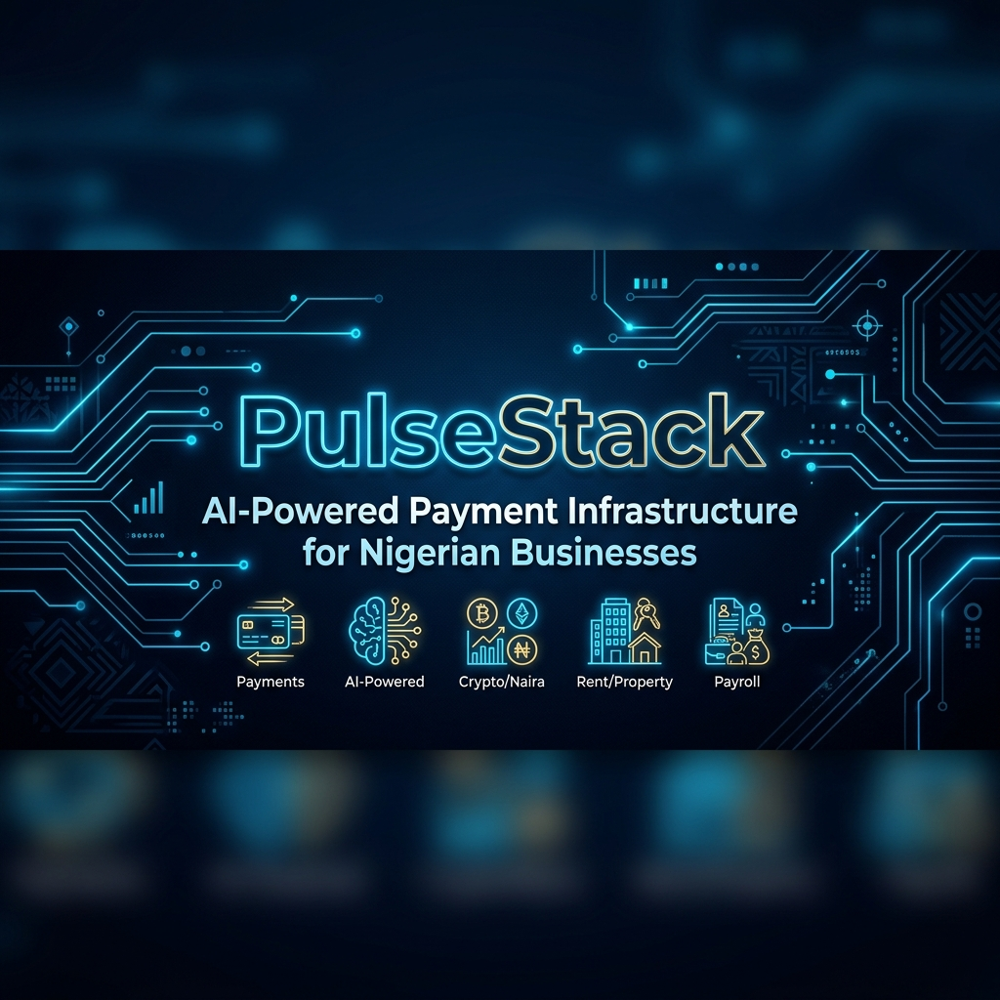

<div align="center">



# PulseStack
### AI-Powered Payment Infrastructure for Nigerian Businesses

[](https://react.dev/)
[](https://www.typescriptlang.org/)
[](https://nomba.com/)
[](https://vitejs.dev/)
[](LICENSE)

**PulseStack** is the next-generation financial intelligence layer built for Nigerian merchants, landlords, and cooperative managers. It sits on top of **Nomba's** production-ready payment APIs, wrapping them inside a powerful automated intelligence framework that helps businesses monitor cash flow, automate payroll, predict defaults, and optimize operations — all powered by AI.

> 🏆 Built for the **DevCareer × Nomba Hackathon 2025** — demonstrating how modern fintech APIs paired with natural language AI and predictive diagnostics can truly elevate the merchant experience in Nigeria.

</div>

---

## 📸 Feature Highlights

| Dashboard Pulse | Smart Payments | Rent & Properties |
|:---:|:---:|:---:|
| Real-time balance, health score & recent transactions | Generate Nomba Payment Links with one-click webhook settlement | AI risk badges, tenant nudges, and rent webhooks |

| Payroll Console | Inventory Intel | Diaspora Remittance |
|:---:|:---:|:---:|
| Bulk payout with anomaly detection & payslip generation | Stockout predictor connected to live sales webhooks | USDT→Naira via NOWPayments + Nomba Rails |

---

## 🚀 Key Features

### 💳 1. Smart Payment Collections
- Accept payments across **Nomba Payment Links**, **Virtual Accounts (Providus/Wema)**, and **QR Codes**
- **Real-Time Security Inspector**: AI flags fraud, card-IP mismatches (e.g. Brazilian cards on Nigerian IPs), and potential chargebacks *before* they settle
- One-click **Copy Link** + **Settle Webhook** simulation per transaction

### 🏠 2. AI Rent & Property Manager
- Map individual Providus/Wema virtual accounts to specific tenants
- **Tenant Default Risk Predictor**: AI calculates delinquency risk (`Low` / `Medium` / `High`) based on historical cycles and local economic indicators — *click any risk badge to open a full AI Risk Profile*
- **Tone-Selectable Auto-Nudges**: Generate payment reminders in **Pidgin Friendly**, **Formal English**, or **Urgent & Firm** tones and dispatch via WhatsApp/SMS

### 👥 3. Smart Payroll & Bulk Payouts
- One-click payroll disbursements powered by the **Nomba Bulk Payout API**
- **AI Anomaly Auditor**: Scans payroll inputs prior to execution to detect duplicate entries, account number mismatches, and ghost workers
- Animated disbursement progress bar with per-employee **digital payslip** generation

### 📦 4. Inventory Intel & Shop Reordering
- Real-time stock depletion connected directly to incoming payment webhooks
- **AI Stockout Predictor**: Forecasts exact stockout dates based on weekly sales velocity
- Automated supplier invoice drafts when inventory hits critical reorder thresholds

### 💰 5. AI Expense Auto-Classifier
- Log expenses using plain English or Pidgin (e.g. *"Bought Mikano generator diesel ₦145,000"*)
- **Auto-Categorizer**: Classifies transactions into distinct groups (Generator/Fuel, Logistics, Staff Feeding, etc.)
- **Waste Detection Alerts**: Flags spending leakages and advises cost optimization alternatives

### 🤝 6. Cooperative & Ajo Pool Manager
- Organise owambe, thrift, or cooperative pools with automated round tracking
- Contributors pay via Nomba checkout links; AI monitors delinquency risk per member
- **Auto-Disburse**: When 100% of members have contributed, a gold "Payout Beneficiary Now" banner appears triggering Nomba Bulk Payout to the cycle's beneficiary

### 🌍 7. Diaspora Remittance Rails
- Accept USDT/USDC deposits from overseas sponsors via a NOWPayments gateway
- Automatically exchanges stablecoins at live parallel rates (₦1,550/$) and routes funds to local Nomba accounts in **0.8 seconds**
- **Corridor Comparison Widget**: Side-by-side comparison showing PulseStack delivers ₦89,900 more per $500 than traditional bank wire

### 🤖 8. PulseAI Natural Language Assistant
- Ask questions in English or Pidgin: *"How much did we spend on logistics?"*, *"Who hasn't paid rent?"*
- Understands and executes commands like *"Run payroll"* or *"Show me high-risk tenants"*
- Sidebar chat interface with streaming response simulation

### 🖥️ 9. Developer Webhook Console
- Built-in terminal showing all API events in real time
- **Log Filters**: Quickly filter by `NOMBA_API`, `AI_AGENT`, `WEBHOOK`, or `CRYPTO_SETTLE` tag
- Simulate any webhook event without touching a real API

---

## 🏗️ Architecture Overview

```
┌─────────────────────────────────────────────────────────────┐
│                        PulseStack UI                        │
│           React 19 + TypeScript + Vite + Custom CSS         │
└───────────────────────────┬─────────────────────────────────┘
                            │
              ┌─────────────▼──────────────┐
              │     PulseAI Engine          │
              │  (mockData.ts + parseCmd)   │
              │  Natural Language Commands  │
              └──────┬──────────┬──────────┘
                     │          │
        ┌────────────▼──┐  ┌────▼──────────────┐
        │  Nomba APIs   │  │  3rd-Party APIs    │
        │               │  │                    │
        │ ∙ Collections │  │ ∙ NOWPayments      │
        │ ∙ Payouts     │  │   (Crypto→Naira)   │
        │ ∙ Payment     │  │ ∙ Twilio SMS       │
        │   Links       │  │   (Rent Nudges)    │
        │ ∙ Virtual     │  │ ∙ Binance P2P      │
        │   Accounts    │  │   (FX Rates)       │
        └───────────────┘  └────────────────────┘
```

---

## 🛠️ Technology Stack

| Category | Technology |
|---|---|
| **Frontend Framework** | React 19 + TypeScript |
| **Build Tool** | Vite 6 |
| **Styling** | Custom CSS — Dark glassmorphism design system, CSS variables, responsive grid |
| **Icons** | Lucide React |
| **Fonts** | Google Fonts — Outfit (UI) + JetBrains Mono (console) |
| **Payment APIs** | Nomba Collections, Virtual Accounts, Bulk Payouts, Payment Links |
| **Crypto Gateway** | NOWPayments (USDT/USDC → NGN) |
| **Communications** | Twilio SMS API (rent nudges) |
| **FX Intelligence** | Binance P2P + CBN Parallel Rate APIs |

---

## 🔧 Installation & Setup

**Prerequisites**: Node.js 18+ and npm

```bash
# 1. Clone the repository
git clone https://github.com/bakarezainab/PulseStack.git
cd PulseStack

# 2. Install dependencies
npm install

# 3. Run the development server
npm run dev
# Open http://localhost:5173

# 4. Lint the codebase
npm run lint

# 5. Build for production
npm run build
```

---

## 🎮 Demo Walkthrough

Once the dev server is running at `http://localhost:5173`:

1. **Landing Page** → Click **"Enter Sandboxed Dashboard"**
2. **Dashboard Pulse** → See live balance, health score, and recent transactions
3. **Smart Payments** → Click **"Settle"** on a pending payment link to simulate a Nomba webhook
4. **Rent & Properties** → Click a risk badge to open the **AI Risk Profile modal**, then draft a tone-selectable nudge
5. **Payroll** → Click **"One-Click Salary Day"** to watch the animated bulk disbursement, then open a payslip
6. **Ajo & Co-op Pools** → Simulate member payments until the pool hits 100%, then click **"Payout Beneficiary Now"**
7. **Diaspora Send** → Submit the remittance form and watch the **Corridor Comparison** widget show PulseStack's savings
8. **Developer Console** (footer) → Use the filter buttons to isolate `NOMBA_API` logs; click **"Simulate"** buttons
9. **PulseAI** (chat icon, top right) → Type *"Who hasn't paid rent?"* or *"Run payroll"*

---

## 🧪 Developer Sandbox Console

PulseStack includes a built-in **Webhook Routing Terminal** at the footer. Simulate real-world Nomba API events:

| Command | Effect |
|---|---|
| `simulatePaymentWebhook('card')` | Settles a card transaction into the merchant balance |
| `simulatePaymentWebhook('rent')` | Updates a tenant's rent status in the Property module |
| `simulatePaymentWebhook('ajo')` | Registers a cooperative member contribution |
| `simulatePaymentWebhook('suspicious')` | Triggers the fraud-detection engine |

Logs are tagged and filterable by: `NOMBA_API` · `AI_AGENT` · `WEBHOOK` · `CRYPTO_SETTLE`

---

## 📁 Project Structure

```
PulseStack/
├── public/
│   └── banner.png              # README banner image
├── src/
│   ├── App.tsx                 # Main dashboard — all views, state & modals
│   ├── mockData.ts             # Business logic, mock state & AI command parser
│   ├── index.css               # Global design system & component styles
│   └── main.tsx                # React entry point
├── index.html                  # HTML shell with font preloads
├── vite.config.ts
├── tsconfig.app.json
└── package.json
```

---

## 🤝 Contributing

Pull requests are welcome. For major changes, please open an issue first to discuss what you'd like to change.

---

## 📄 License

MIT © 2025 [Zainab Bakare](https://github.com/bakarezainab) — Built with ❤️ for the DevCareer × Nomba Hackathon


---

## 🆕 Latest Updates (v2.0)

### 📊 Three New Dashboard Pages

#### 1. Analytics Dashboard
- **Revenue Overview** - Monthly revenue with growth percentage and trend charts
- **Expense Tracking** - Categorized spending with pie charts
- **Net Profit Margins** - Real-time profitability analysis
- **Payment Channels Breakdown** - Visual distribution across payment methods
- **Transaction Volume Trends** - 7-day bar charts with daily amounts
- **Top Performers** - Ranked list of best-paying tenants
- **Key Metrics Summary** - Total transactions, paid tenants, active employees

#### 2. Settings Panel
- **Appearance Settings** - Dark mode, sound effects, compact mode
- **Notification Management** - Push notifications, email/SMS alerts
- **Business Configuration** - Language (English/Pidgin), currency display
- **Account Information** - Business details, Nomba Merchant ID, account status
- **Security Settings** - 2FA, API keys, transaction PIN
- **Nomba API Configuration** - Live connection status, test API connection, toggle between live/simulation modes

#### 3. Help & Support Center
- **Quick Actions** - Documentation, contact support, submit feedback
- **Contact Information** - Email, phone, support hours, live chat
- **Office Location** - Physical address with map integration
- **FAQ Section** - Searchable knowledge base with 6+ common questions
- **System Status Dashboard** - Real-time uptime monitoring for all services
- **Version Information** - App version, changelog, update checker

### 🔌 Full Nomba API Integration

#### Live API Features
- ✅ **Authentication System** - Automatic token management and refresh
- ✅ **Payment Link Creation** - Real API calls to Nomba Checkout
- ✅ **Bulk Payout Processing** - One-click salary disbursement via Nomba
- ✅ **Balance Synchronization** - Real-time account balance fetching
- ✅ **Transaction History** - Pull actual transaction data
- ✅ **Virtual Account Creation** - Generate accounts for tenants
- ✅ **Bank List Retrieval** - Get supported banks for payouts
- ✅ **Transaction Verification** - Confirm payment status

#### Dual Mode Operation
- **Live API Mode** 🟢 - Real Nomba API integration with actual credentials
- **Simulation Mode** 🟡 - Mock data for testing without API calls
- **Seamless Switching** - Toggle between modes in Settings or header
- **Automatic Fallback** - If API fails, gracefully switches to simulation
- **Connection Indicator** - Visual status in header with WiFi icon

#### API Architecture
```
src/
├── services/
│   ├── nombaApi.ts          # Core API service layer
│   └── webhookHandler.ts    # Webhook processing engine
├── hooks/
│   └── useNombaApi.ts       # React hook for components
└── .env                     # Secure credential storage
```

#### Credentials Configured
- **Parent Account ID**: `f666ef9b-888e-4799-85ce-acb505b28023`
- **Sub-Account ID**: `3f550c64-55ed-42b8-ac1d-9305ec2781d3`
- **TEST Mode**: Active (706df6c4-b8bb-4130-88c4-d21b052f8631)
- **LIVE Mode**: Ready (e5e85b13-f560-4643-814e-c87435dbbc15)

See [NOMBA_API_INTEGRATION.md](./NOMBA_API_INTEGRATION.md) for complete API documentation.

---

## 📈 Commit History

The project includes **24+ commits** with incremental feature additions:

1. ✅ Add new page navigation (Analytics, Settings, Help)
2. ✅ Create Analytics page with charts and metrics
3. ✅ Build Settings panel with all configurations
4. ✅ Develop Help center with FAQs and support
5. ✅ Add CSS animations for new pages
6. ✅ Integrate Nomba API service layer
7. ✅ Create useNombaApi React hook
8. ✅ Add webhook processing system
9. ✅ Implement payment link creation
10. ✅ Add bulk payout functionality
11. ✅ Display API connection status
12. ✅ Add API configuration panel
13. ✅ Create comprehensive documentation
14. ✅ Bug fixes and TypeScript improvements

---

## 🎯 Roadmap

- [ ] Add transaction filtering by date range
- [ ] Export analytics reports as PDF/CSV
- [ ] Multi-language support expansion
- [ ] Mobile responsive optimization
- [ ] Dark/Light theme toggle
- [ ] Webhook signature verification
- [ ] Real-time WebSocket updates
- [ ] Email notification system
- [ ] SMS integration with Twilio
- [ ] Advanced AI fraud detection

---

## 📞 Support

### For Nomba API Issues
- 📧 Email: support@nomba.com
- 📖 Documentation: https://docs.nomba.com
- 🔑 Dashboard: https://dashboard.nomba.com

### For PulseStack Application
- 💬 GitHub Issues: https://github.com/bakarezainab/PulseStack/issues
- 📧 Email: support@pulsestack.io
- 🌐 Website: https://pulsestack.io

---

**Made with ❤️ in Nigeria | DevCareer × Nomba Hackathon 2026**
